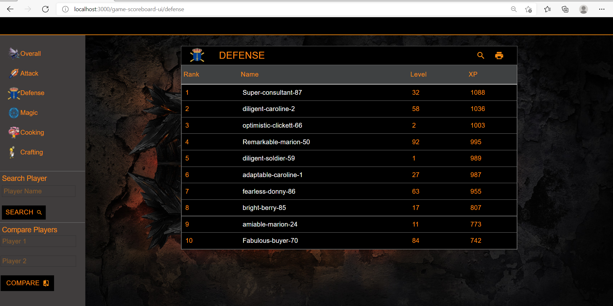
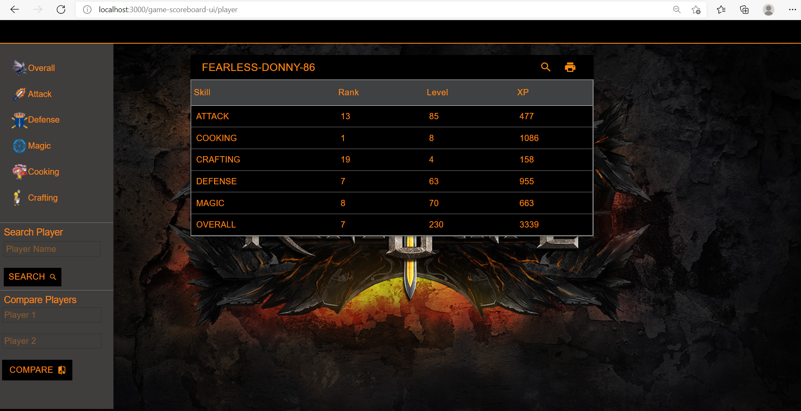
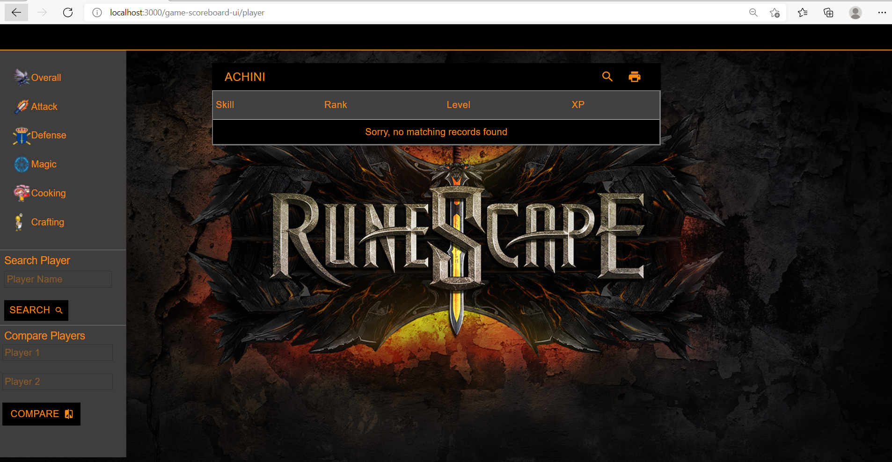
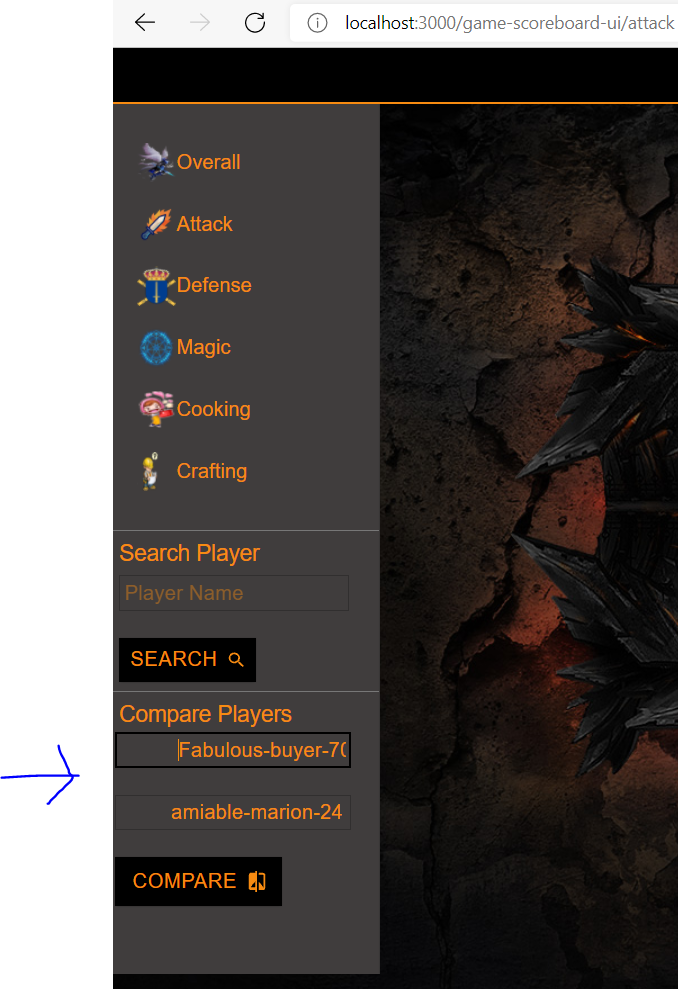
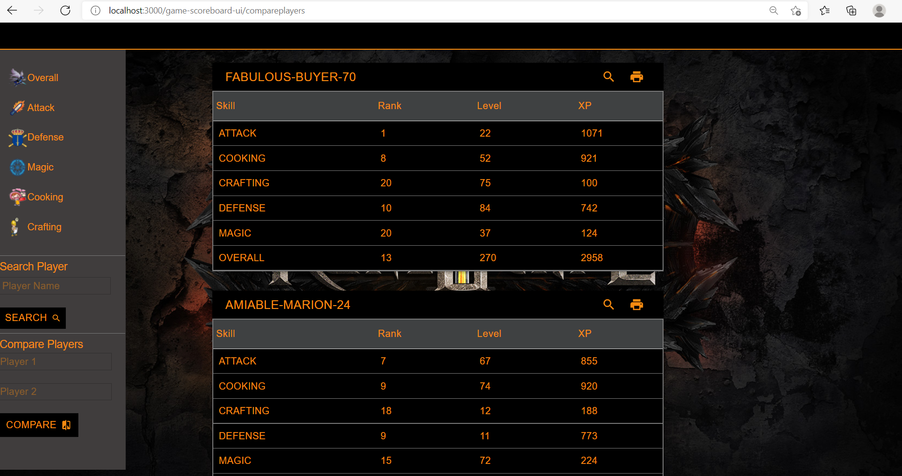

# Leader Board UI
Leader Board API

### Project

-This project is hosted in
https://achinip.github.io/game-scoreboard-ui
 
frontend is hosted in git-pages and backend is deployed in AWS

## To Set up Locally

## Prerequisites
- Backend should Be up and Running in http://localhost:8000/v1/score to display data
- Kindly refer https://achinip.github.io/scoreboard-api/ for backend set up instructions. (backend code - https://github.com/AchiniP/scoreboard-api)
- If you need to change the backend url go to src/utils/AppGlobal.js and change scoreAPIRoute 

## Starting Project

### To start the project in local environment
 
- `npm install
  `
- `npm start
  `

### Features

#### Upon Starting the app you will be redirected to Overall HighScore Page which includes top 10 users.

#### Upon Click on User Name, Corresponding user's Score card will be displayed.

#### Upon CLick On Each category, It will show the top 10 Users of Each category.

#### By Entering User's Name you can Search for Particular User's Score Card

#### If No User Data is found for given search text, It will show following page

#### Also you can compare two users 

#### If you enter an invalid user name to compare, then only valid user's data will be displayed

#### used libraries

- react v17
- material UI - Google material design UI components V4

#### dev dependencies
- eslint (for linting)

### UI Design Assumptions

- UI will show top 10 users in each category
- Overall category's score will be determined by the sum of the score of other categories
- Overall category's level will be determined by the sum of the level of other categories
- This application is designed to display leaderboard. Any features to update score, add players etc were not added

